# 📈 Trading Journal

A professional, cross-platform Java desktop application for analyzing your MetaTrader 5 trading performance. Import your trade history directly and visualize your edge with comprehensive analytics and beautiful UI.


## ✨ Features

- **📊 Advanced Analytics**: Real-time calculation of Win Rate, Profit Factor, Expected Value, Sharpe Ratio, and more
- **💹 Equity Curve**: Visualize your account growth with dynamic equity curve and drawdown analysis
- **📅 Period Analysis**: Breakdown performance by Weekday, Hour, and Month with detailed charts
- **🏷️ Strategy Tagging**: Tag trades by strategy/setup (e.g., "ORB", "Z-Score") to see what works best
- **✏️ Full Edit Capability**: Edit every field of your trades including prices, dates, and P/L
- **🔄 MT5 Integration**: Seamless import from MetaTrader 5 using our custom `TradeExporter` script
- **🎯 Smart Import**: Assign account and strategy to all trades during import
- **➕ Manual Trade Entry**: Add trades manually with a user-friendly dialog for data not in MT5
- **🗑️ Trade Management**: Delete individual trades or clear all at once
- **♻️ Rename & Update**: Rename accounts or strategies and automatically update all associated trades
- **📂 Multi-Account**: Manage multiple trading accounts with starting balances
- **📝 Trade Notes**: Add comments and post-trade analysis to your records
- **📓 Notes Tab**: Dedicated space for writing and managing trading journal notes, ideas, and observations
- **🎨 Professional UI**: Custom application icon and modern interface
- **🌍 Cross-Platform**: Works on Windows, macOS, and Linux

---

## 🚀 Getting Started

### Prerequisites

**All Platforms:**
- Java 11+ (JDK recommended for building)
- MetaTrader 5 (for exporting trading data)
  - Windows: [Download MT5](https://www.metatrader5.com/en/download)
  - macOS: [Download MT5 for Mac](https://download.mql5.com/cdn/web/metaquotes.software.corp/mt5/MetaTrader5.dmg)
  - Linux: [Download MT5 for Linux](https://www.metatrader5.com/en/download/linux)

**Windows:**
- Windows 10/11

**macOS:**
- macOS 10.14+
- Install Java: `brew install openjdk@11`
- Maven (optional): `brew install maven`

**Linux:**
- Ubuntu/Debian or compatible distro
- Install Java: `sudo apt install openjdk-11-jdk`
- Maven (optional): `sudo apt install maven`

### Installation

#### Windows
1. Download the latest release
2. Unzip to a folder (e.g., `C:\Journal`)
3. Double-click **`TradingJournal.exe`** to launch

#### macOS / Linux
1. Clone or download this repository
2. Make scripts executable:
   ```bash
   chmod +x run.sh build.sh
   ```
3. Build the application:
   ```bash
   ./build.sh
   ```
4. Run the application:
   ```bash
   ./run.sh
   ```
   Or directly:
   ```bash
   java -jar target/trading-journal-1.0.0.jar
   ```

---

## 📥 Importing Trades

### Step 1: Install Exporter Script
1. Navigate to the **`Trade Exporter/`** folder in this repository
2. Copy **`TradeExporter.ex5`**
3. Open MetaTrader 5, go to **File** → **Open Data Folder**
4. Navigate to **`MQL5\Scripts\`** (Windows) or **`MQL5/Scripts/`** (macOS/Linux)
5. Paste the file there
6. In MT5 Navigator window (Ctrl+N / Cmd+N), right-click **Scripts** and select **Refresh**


### Step 2: Export Data
1. Drag **`TradeExporter`** from Navigator onto any chart
2. Click **OK**
3. A file named `TradingJournal_Export.txt` will be created in `MQL5/Files`
   - **Windows**: `%APPDATA%\MetaQuotes\Terminal\[instance]\MQL5\Files`
   - **macOS**: `~/Library/Application Support/MetaTrader 5/Bottles/[instance]/drive_c/users/[user]/Application Data/MetaQuotes/Terminal/[instance]/MQL5/Files`
   - **Linux**: `~/.wine/drive_c/Program Files/MetaTrader 5/MQL5/Files`

### Step 3: Import into Journal
1. Open **Trading Journal**
2. Click **"Import TXT"**
3. Select the exported text file
4. **Choose an account** for the imported trades
5. **Optionally choose a strategy** to assign to all trades
6. Your trades will appear instantly!

---

## 🧹 Managing Data

### Screenshots

<p align="center">
  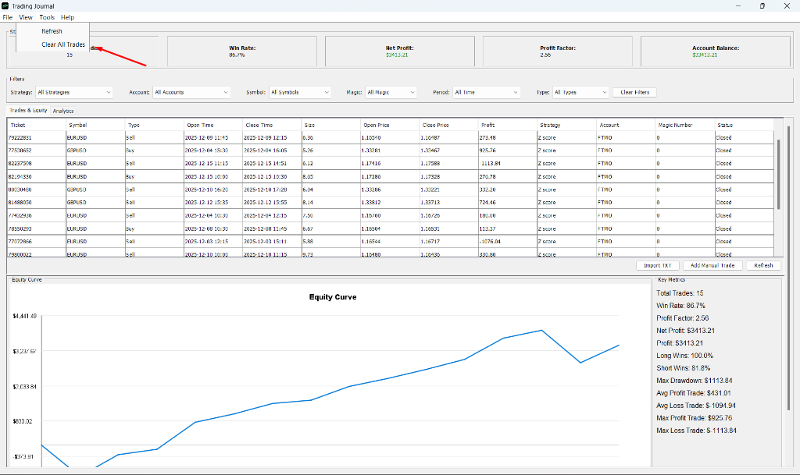
  <br><em>Main application window with trade list and analytics</em>
</p>

### Managing Trades

**Clear All Trades:**
- Click **File** → **Clear All Trades** in the menu bar

**Delete Individual Trades:**
1. **Double-click** any trade in the table
2. Click the **"Delete"** button
3. Confirm the deletion

<p align="center">
  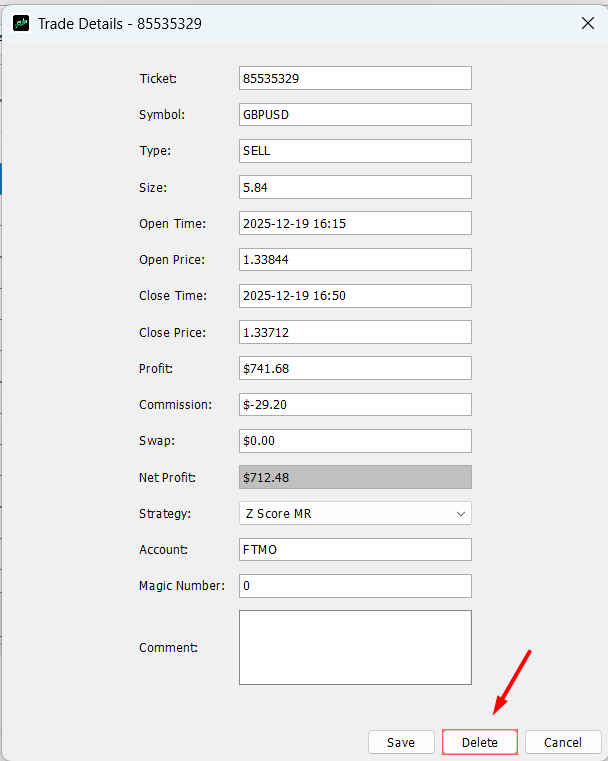
  <br><em>Trade Details dialog - Edit everything, then Save or Delete</em>
</p>

**Edit All Trade Fields:**
1. **Double-click** any trade to open Trade Details
2. Edit any field (prices, dates, P/L, commission, strategy, etc.)
3. Click **"Save"** to apply changes

> **💡 Tip:** Net Profit is calculated automatically from Profit + Commission + Swap

### Managing Strategies

<p align="center">
  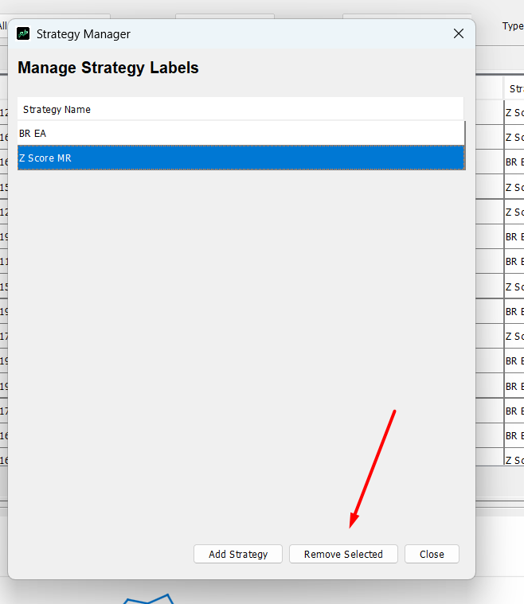
  <br><em>Strategy Manager dialog</em>
</p>

**Tools** → **Manage Strategies**:
- **Add Strategy**: Create new strategy labels
- **Rename Selected**: Rename a strategy (automatically updates all trades)
- **Remove Selected**: Delete a strategy label

### Managing Accounts

<p align="center">
  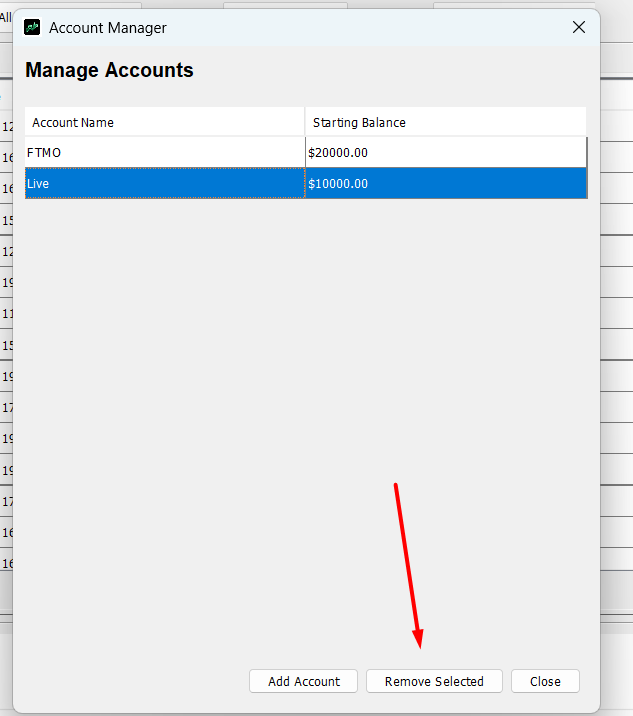
  <br><em>Account Manager dialog</em>
</p>

**Tools** → **Manage Accounts**:
- **Add Account**: Create account with starting balance
- **Rename Selected**: Rename an account (automatically updates all trades)
- **Remove Selected**: Delete an account

---

## 🛠️ Building from Source

### Using Maven (Recommended)

```bash
# Clone the repository
git clone https://github.com/janzofx/Trading_Journal.git
cd Trading_Journal

# Build
mvn clean package

# Run
java -jar target/trading-journal-1.0.0.jar
```

### Platform-Specific Scripts

**Windows:**
```batch
build_app.bat
TradingJournal.exe
```

**macOS/Linux:**
```bash
./build.sh
./run.sh
```

---

## � Application Overview

### 1. Main Dashboard
The main dashboard gives you an instant health check of your trading performance.

<p align="center">
  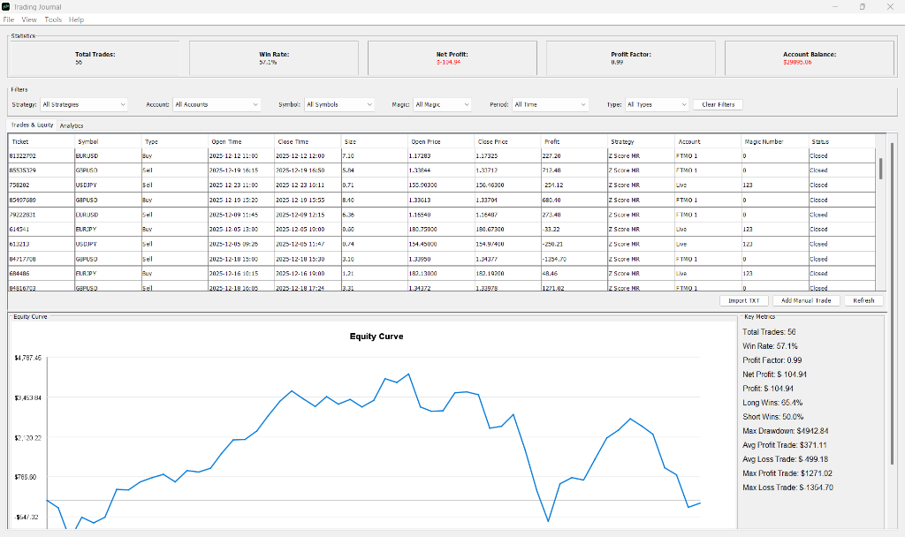
</p>

*   **Equity Curve**: Visualizes the growth of your account over time. A healthy curve moves from bottom-left to top-right.
*   **Trade List**: Detailed table of every trade. Double-click any row to edit prices, dates, or add notes.
*   **Quick Stats**: Immediate view of your Win Rate, Net Profit, and Profit Factor at the top.

### 2. Powerful Filters
Drill down into your data to find exactly what is working—and what isn't.

<p align="center">
  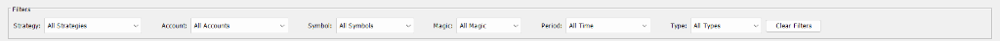
</p>

*   **Strategy**: Filter by specific setups (e.g., "Trend Following" vs "Reversal").
*   **Symbol**: See which instruments trigger the most wins.
*   **Account**: Toggle between different trading accounts (e.g., "Live" vs "Prop Firm").
*   **Time**: Filter by specific date ranges.

### 3. Analytics & Performance
Switch to the **Analytics** tab for deep-dive statistics.

**Performance Overview:**
<p align="center">
  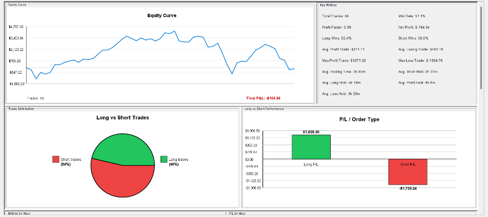
</p>

**Detailed Breakdown (Hourly & Daily):**
<p align="center">
  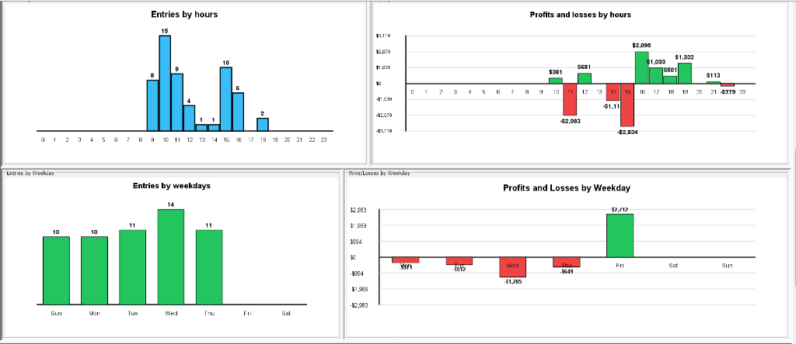
</p>

**Monthly Progress:**
<p align="center">
  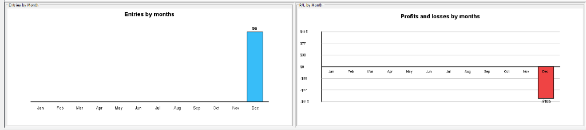
</p>

*   **Win/Loss by Day**: Identify your best trading days of the week.
*   **Hourly Performance**: Find your most profitable times of day.
*   **Long vs Short**: Analyze directional bias in your trading.

### 4. Smart Import
Importing trades is easier than ever. The import dialog now lets you bulk-assign properties.

<p align="center">
  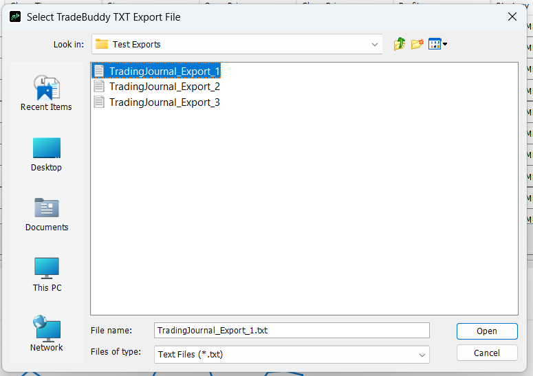
</p>

*   **Account Assignment**: Assign all imported trades to a specific account (e.g., "FTMO Challenge").
*   **Strategy Assignment**: Tag an entire batch of trades with a strategy (e.g., "News Trading") instantly.

### 5. Manual Trade Entry
Forgot to log a trade? Add it manually.

<p align="center">
  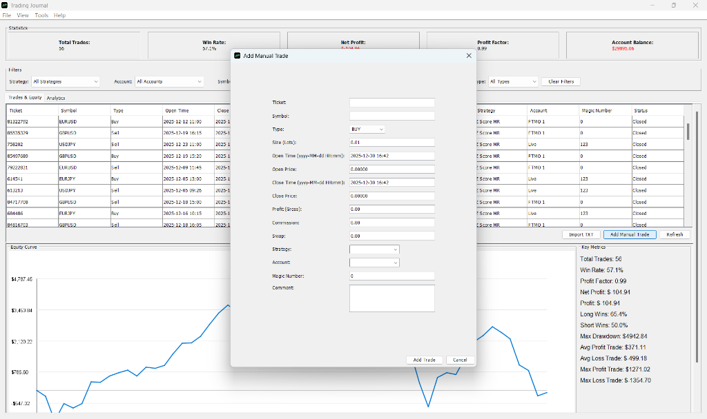
</p>

*   **Complete Data**: Enter entry/exit prices, times, and volume.
*   **Calculations**: The system will automatically calculate P/L if you provide prices and size.

### 6. Notes Tab
Capture your trading thoughts, strategies, and observations in a dedicated notes section.

<p align="center">
  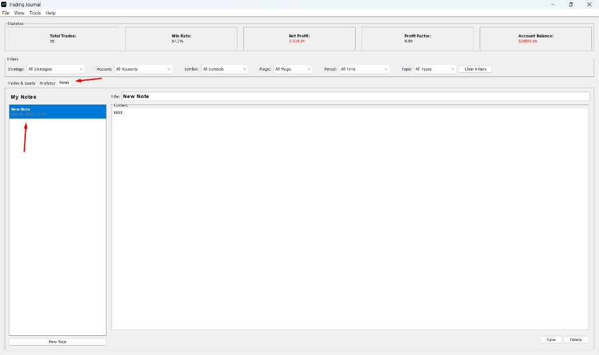
</p>

*   **Organized Notes**: Create and manage multiple notes with titles and timestamps
*   **Rich Editor**: Write detailed trading journal entries, strategy ideas, or market observations
*   **Auto-Save**: Changes are automatically saved when switching between notes
*   **Persistent Storage**: All notes are saved locally and persist across sessions

---

## 📊 Metrics Dictionary

Understanding your stats is key to improvement. Here is what every number tells you:

| Metric | Definition | Why it Matters |
| :--- | :--- | :--- |
| **Net Profit** | `Total Profit - Total Loss` | The bottom line. Are you making money? |
| **Profit Factor** | `Gross Profit / Gross Loss` | Measures the efficiency of your strategy. <br>• **< 1.0**: Losing strategy<br>• **1.0 - 1.5**: Marginal / Break-even<br>• **1.5 - 2.0**: Good<br>• **> 2.0**: Excellent |
| **Win Rate** | `(Winning Trades / Total Trades) * 100` | How often you are right. Note: High win rate doesn't guarantee profit if losses are large. |
| **Expectancy** | `(Avg Win * Win Rate) - (Avg Loss * Loss Rate)` | The average amount you can expect to earn (or lose) per trade over the long run. Positive expectancy = profitable edge. |
| **Sharpe Ratio** | Risk-adjusted return metric. | Measures return per unit of risk. Higher is better (usually > 1.0). |
| **Max Drawdown** | Largest peak-to-valley percentage drop. | Measures the risk of your strategy. Lower is safer. |
| **SQN (System Quality Number)** | Statistical score of your trading system. | Used to evaluate the "quality" of your edge. <br>• **< 1.6**: Poor<br>• **1.6 - 2.0**: Average<br>• **2.0 - 2.5**: Good<br>• **> 3.0**: Excellent |
| **Z-Score** | Statistical measure of streaks. | Tells you if wins/losses are random or clustered. |

---

## 📂 Project Structure

```
Trading Journal/
├── src/main/java/           # Java Source Code
│   └── com/tradingjournal/
│       ├── model/           # Data models (Trade, Account, Note, etc.)
│       ├── repository/      # Data persistence layer
│       ├── service/         # Business logic
│       └── ui/              # Swing UI components
├── Trade Exporter/          # MT5 Export Script (.ex5 / .mq5)
├── screenshots/             # Application screenshots
├── target/                  # Compiled binaries (generated)
├── TradingJournal.exe       # Windows launcher
├── run.sh                   # macOS/Linux launcher
├── build_app.bat            # Windows build script
├── build.sh                 # macOS/Linux build script
├── icon.png                 # Application icon (PNG)
├── icon.ico                 # Application icon (ICO)
├── pom.xml                  # Maven configuration
├── trades.json              # Your trade database (auto-generated)
├── accounts.json            # Account data (auto-generated)
├── strategies.json          # Strategy labels (auto-generated)
└── notes.json               # Your notes database (auto-generated)
```

---

## 🌍 Platform Support

| Platform | Status | Notes |
|----------|--------|-------|
| **Windows 10/11** | ✅ Full Support | Native `.exe` launcher with custom icon |
| **macOS** | ✅ Full Support | Run via `./run.sh` or JAR directly |
| **Linux** | ✅ Full Support | Run via `./run.sh` or JAR directly |
| **MT5 Integration** | ✅ All Platforms | MT5 available natively on Windows, macOS, and Linux |

---

## 🎨 New in Recent Updates

### 🆕 Latest Features
- ✅ **Notes Tab** - Dedicated space for writing trading journal notes and observations
- ✅ **Full trade editing** - Edit every field in Trade Details dialog
- ✅ **Strategy selection during import** - Assign strategies when importing trades
- ✅ **Account renaming** - Rename accounts and auto-update all trades
- ✅ **Strategy renaming** - Rename strategies and auto-update all trades
- ✅ **macOS/Linux support** - Cross-platform shell scripts
- ✅ **Enhanced UI** - Professional custom icon and improved dialogs
- ✅ **Better screenshots** - Complete visual guide in README

---

## 🤝 Contributing

Contributions are welcome! Please feel free to submit a Pull Request.

1. Fork the project
2. Create your feature branch (`git checkout -b feature/AmazingFeature`)
3. Commit your changes (`git commit -m 'Add some AmazingFeature'`)
4. Push to the branch (`git push origin feature/AmazingFeature`)
5. Open a Pull Request

---

## 📄 License

This project is open source and available for personal and educational use.

---

**Happy Trading!** 📉📈

*Built with ❤️ using Java, Swing, and JFreeChart*
