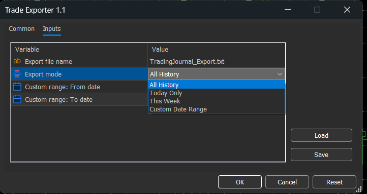

# Trade Exporter for MetaTrader 5

Export your MT5 trading history to TXT format for use with the Trading Journal application.

## 📋 Overview

**TradeExporter** is a high-performance MetaTrader 5 script that exports your closed trades to a generic format compatible with the Trading Journal. It uses advanced caching to ensure 100% data accuracy.

## ✨ Features

- ✅ **Instant Export**: Exports thousands of trades in milliseconds.
- ✅ **Complete Data**: Exports 15 fields per trade including:
  - **Basic Info**: Ticket, Symbol, Volume (lots), Type (Long/Short)
  - **Prices & Times**: Open/Close Price, Open/Close Time
  - **Financials**: Commission, Swap, Profit
  - **Trading Parameters**: Stop Loss, Take Profit, Magic Number
  - **Strategy**: Custom strategy/comment field
- ✅ **Reliable**: Bypasses MT5 API limitations using smart caching.
- ✅ **Plug & Play**: Works with any broker and any symbol.

## 📦 Installation

### Option 1: Quick Install (Recommended)

1. **Locate the File**: Finds `TradeExporter.ex5` in this folder.
2. **Open MT5 Data Folder**:
   - In MetaTrader 5, go to **File** → **Open Data Folder**.
3. **Copy the File**:
   - Navigate to **`MQL5\Scripts\`**.
   - Paste `TradeExporter.ex5` into this folder.
4. **Refresh**:
   - In MT5 Navigator (Ctrl+N), right-click on **Scripts** and select **Refresh**.
   - `TradeExporter` should now appear in the list.

### Option 2: Compile from Source (Advanced)
If you want to modify the code:
1. Copy `TradeExporter.mq5` to `MQL5\Scripts\`.
2. Open it in **MetaEditor** (F4).
3. Press **F7** to Compile.

## 🚀 Usage

1. **Open any chart** in MT5.
2. **Double-click** or drag `TradeExporter` onto the chart.
3. **Configure Settings**:
   - **FileName**: `TradingJournal_Export.txt` (Default filename for export).
   - **ExportMode**: Choose your export range:
     - **0** - Export entire trading history
     - **1** - Export today only
     - **2** - Export this week (Monday to Sunday)
     - **3** - Export custom date range (specify StartDate and EndDate)
   - **StartDate**: Start date for custom range (YYYY.MM.DD) - only used when ExportMode = 3
   - **EndDate**: End date for custom range (YYYY.MM.DD) - only used when ExportMode = 3
4. **Click OK**.
5. The file will be saved to your MT5 Files folder!



### Export Mode Examples:
- **Full History**: Set ExportMode = 0
- **Today's Trades**: Set ExportMode = 1  
- **This Week**: Set ExportMode = 2
- **December 2025**: Set ExportMode = 3, StartDate = 2025.12.01, EndDate = 2025.12.31

## 📂 Where is my file?

The exported text file is saved in:
```
[MT5 Data Folder]\MQL5\Files\TradingJournal_Export.txt
```

**To find it quickly:**
1. In MT5, go to **File** → **Open Data Folder**.
2. Open **`MQL5`** → **`Files`**.

## � Import into Trading Journal

1. Open **Trading Journal**.
2. Click **Import TXT**.
3. Select the file you just found.
4. Done!

## 🔧 Export File Format

The exported file uses semicolon-separated values with the following 15 fields per trade:

```
Ticket;Symbol;Volume;Type;OpenPrice;OpenTime;ClosePrice;CloseTime;Commission;Swap;Profit;StopLoss;TakeProfit;MagicNumber;Strategy;
```

### Field Descriptions:
1. **Ticket**: Unique trade identifier
2. **Symbol**: Trading instrument (e.g., EURUSD, GBPUSD)
3. **Volume**: Position size in lots
4. **Type**: "Long" or "Short"
5. **OpenPrice**: Entry price
6. **OpenTime**: Entry timestamp (YYYY.MM.DD HH:MM)
7. **ClosePrice**: Exit price
8. **CloseTime**: Exit timestamp (YYYY.MM.DD HH:MM)
9. **Commission**: Trading fees
10. **Swap**: Overnight financing charges
11. **Profit**: Net profit/loss in account currency
12. **StopLoss**: Stop loss price (0.00000 if not set)
13. **TakeProfit**: Take profit price (0.00000 if not set)
14. **MagicNumber**: EA identifier (0 for manual trades)
15. **Strategy**: Custom comment/strategy name

### Example:
```
77072866;EURUSD;5.88;Short;1.16544;2025.12.03 12:15;1.16717;2025.12.03 15:11;-29.40;0.00;-1046.64;0.00000;0.00000;0;Z-Score Short;
```

**Note**: Only closed trades are exported. Open positions are ignored.

## 📝 License
Free to use with the Trading Journal application.
